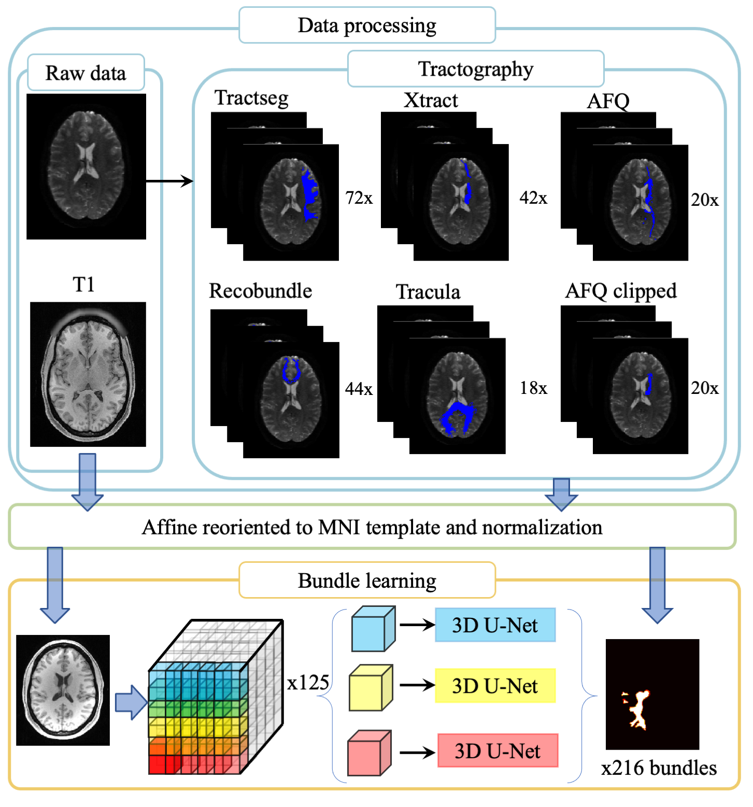

## White matter learning

### White matter learning-Introduction

We proposed spatial localized patch-wise framework to delineate white matter regions from structural image. To achieve this target, we select six state-of-the-art (TractSeg,Recobundle,Xtract,Tracula,AFQ and AFQ_clipped) tractography algorithms to reconstruct white matter pathways as ground-truth to supervise whole training process. The pipeline of proposed method is shown in the following figure



We envision the proposed framework as a tool to localize white matter regions of interest when diffusion image is not present. The output of propo sed framework is similar to a probability map rather than a binary image, which can provide user with more options to adjust threshold to adjust bundle overlap or bundle overreach for one specific white matter pathway. Different bundle segmentation algorithms do not have exactly same definition for same white matter tracts. Thus, we provide six definition schemes for user to reconstruct white matter in their preferred scheme.


### Source code
The github repo includes the train, valdiation and testing code. The different folder name corresponding to different tractography algorithm. As for specific output of each tractography algorithm, please check this [repo](https://github.com/MASILab/Pandora-WhiteMatterAtlas)

### Singularity

All source code, binaries, and third-party dependencies have been packaged into Singularity containers. Each algorithm is associated with a separate Singularity image and a corresponding PyTorch model archive, all hosted on Zenodo.

To support algorithm reproducibility, we also provide a sample test T1-weighted image along with its corresponding output files for user validation, available on Zenodo.

Below are the Zenodo links for each algorithm’s Singularity image and model files:

- **[TractSeg](https://zenodo.org/records/15320036)**
- **[RecoBundles](https://zenodo.org/records/15339811)**
- **[XTRACT](https://zenodo.org/records/15339809)**
- **[Tracula](https://zenodo.org/records/15320865)**
- **[AFQ](https://zenodo.org/records/15320033)**
- **[AFQClipped](https://zenodo.org/records/15339817)**

In the following section, we provide step-by-step instructions for running each Singularity image.

**Note:**  
- All Singularity images currently support **GPU mode only**.
- The recent tests (as of **May 6, 2025**) NVIDIA 1080 Ti systems run without this warning and are fully compatible.
- The recent tests (as of **May 1, 2025**) were validated on **NVIDIA 2080 Ti** GPUs. A non-fatal warning may appear on 2080 Ti systems due to a CUDA kernel compatibility issue, but it does not affect the output. 
- Model loading issues have been observed on newer GPUs (e.g., **A6000**).  
- **CPU mode is not fully tested** at this time.

#### Step 1. Prepare your input and output directory
Let's assume that you work in the $HOME directory. So you can call following command
```
mkdir $HOME/{INPUTS,OUTPUTS}
```

#### Step 2. Move your T1 file into INPUTS directory

```
mv $your_T1_file $HOME/INPUTS
```
Then, the raw T1 file would be moved into $HOME/INPUTS folder. In the INPUTS directory, we don't make any assumption about the name of T1. But we assume that T1 file should be in format of **.nii.gz**

### Step 3. Download Your Singularity Image and the Latest Model for Each Algorithm

For each method:

- Let `$singularity_path` be the path to the downloaded Singularity image.
- Unzip the model `.tar.gz` file and place its contents in a directory, which you will refer to as `$algorithm_model_path`.

---

### Step 4. Run the Singularity Image

```bash
singularity run \
  --bind $HOME/INPUTS:/INPUTS \
  --bind $HOME/OUTPUTS:/OUTPUTS \
  --bind $algorithm_model_path:/MODEL \
  --contain -e --nv $singularity_path
```

### Step 5 Check output

We have six singularity. The output of each of them can be checked in the followin link [TractSeg](./output/tractSeg.md),[RecoBundles](./output/recobundle.md) [XTRACT](./output/xtract.md),[Tracula](./output/tracula.md) [AFQ](./output/AFQ.md) [AFQclipped](./output/AFQclipped.md). The relationship between file name and saved white matter tract name can be found in doc folder in this repository.

### Optional Notes on Label Outputs
> The current pipeline uses `antsApplyTransforms` with **BSpline (bicubic-like)** interpolation for warping label images.  
> This may introduce small negative or non-integer values, which are **not ideal for discrete segmentation labels**.  
> Since this setting is hardcoded inside the Singularity image, **you cannot change it directly**.  
> You are encouraged to apply a simple postprocessing step to round values and remove negatives, especially if you need to ensure that output labels remain discrete and integer-valued.

### Reference:

Qi Yang*, Colin B. Hansen*, Leon Y. Cai, Francois Rheault, Ho Hin Lee, Shunxing Bao, Bramsh Qamar Chandio, Owen Williams, Susan M. Resnick, Eleftherios Garyfallidis, Adam W. Anderson, Maxime Descoteaux, Kurt G. Schilling, Bennett A. Landman. Learning white matter subject-specific segmentation from structural MRI. Medical physics 49.4 (2022): 2502-2513.

### Contact:
If you find any issues or questions, please feel free to contact MASI lab supervisor (bennett.landman@vanderbilt.edu)
