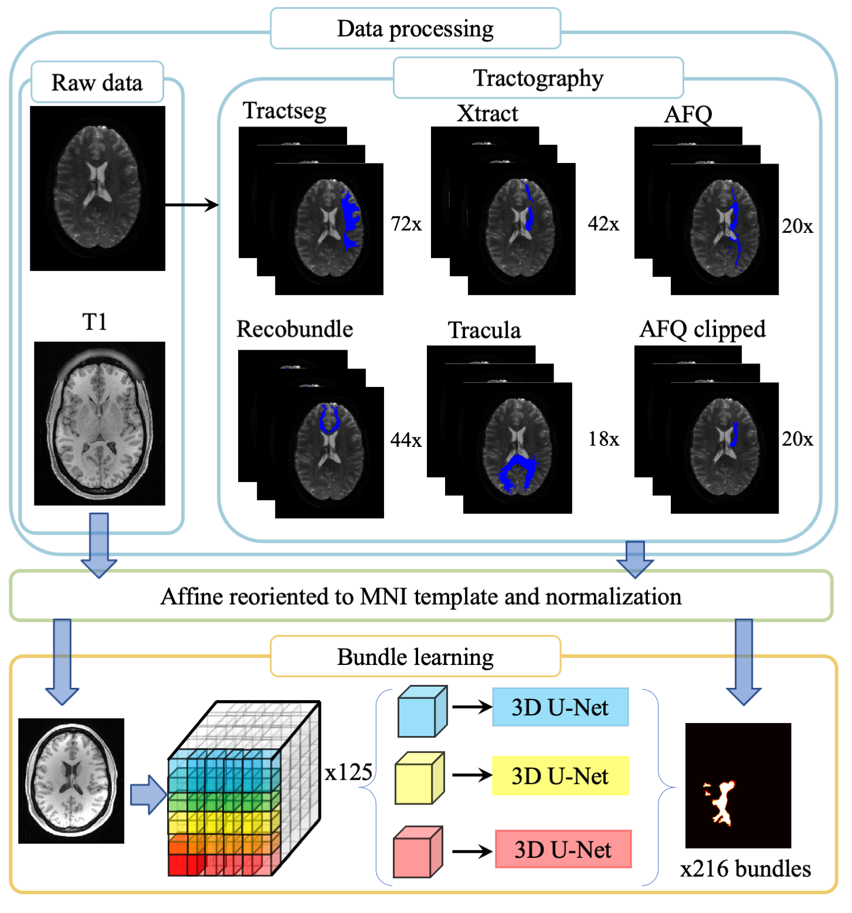

## White matter learning

### White matter learning-Introduction

We proposed spatial localized patch-wise framework to delineate white matter regions from structural image. To achieve this target, we select six state-of-the-art (TractSeg,Recobundle,Xtract,Tracula,AFQ and AFQ_clipped) tractography algorithms to reconstruct white matter pathways as ground-truth to supervise whole training process. The pipeline of proposed method is shown in the following figure



We envision the proposed framework as a tool to localize white matter regions of interest when diffusion image is not present. The output of propo sed framework is similar to a probability map rather than a binary image, which can provide user with more options to adjust threshold to adjust bundle overlap or bundle overreach for one specific white matter pathway. Different bundle segmentation algorithms do not have exactly same definition for same white matter tracts. Thus, we provide six definition schemes for user to reconstruct white matter in their preferred scheme.


### Source code
The github repo includes the train, valdiation and testing code. The different folder name corresponding to different tractography algorithm. As for specific output of each tractography algorithm, please check this [repo](https://github.com/MASILab/Pandora-WhiteMatterAtlas)

### Singularity

All sorce code binaries, and third-party dependencies have been packaged into a singulairty container. Each method corresponding to one singularity. In the following part, we will show how to run singularity step by step.

#### Step 1. Build input and output directory
Let's assume that you work in the $HOME directory. So you can call following command
```
mkdir $HOME/{INPUTS,OUTPUTS}
```
#### Step 2. Move your T1 file into INPUTS directory

```
mv $your_T1_file $HOME/INPUTS
```
Then, the raw T1 file would be moved into $HOME/INPUTS folder.

#### Step 3 Run the singularity

```
singularity run --bind $HOME/INPUTS:/INPUTS --bind $HOME/OUTPUTS:/OUTPUTS --contain -e --nv $singularity_path
```

### Step 4 Check output

We have six singularity. The output of each of them can be checked in the followin link [tractSeg](.output/tractSeg.md),[RecoBundle](./output/recobundle.md) [Xtract](./output/xtract.md),[tracula](./output/tracula.md) [AFQ](./output/AFQ.md) [AFQclipped](./output/AFQclipped.md)

All the singularities can be found at this [link](https://vanderbilt365-my.sharepoint.com/:f:/g/personal/qi_yang_vanderbilt_edu/EpMsl1c0o69NiNBs4JzEPVABTezoFWPZTHOhwxGByVcVYw) 

### Reference:
 Need to be updated

### Contact:
If you find any issues or questions, please feel free to contact me (qi.yang@vanderbilt.edu)
